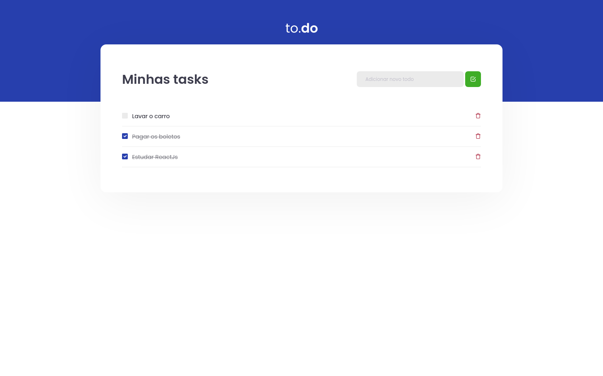

# React - To Do

  

## Sobre

Desafio proposto durante a trilha de React JS da [Rocketseat](https://www.rocketseat.com.br/). Trata-se de um gerenciador de tarefas. Nele é possível criar, alterar o status e excluir afazeres.

[Link de acesso](https://leottx.github.io/rocketseat-reactjs-todo-list/) 🔗

## Aprendizados

- [x] React Hook useState
- [x] Criação e manipulação de estados
- [x] Passagem de valores entre componentes via props
